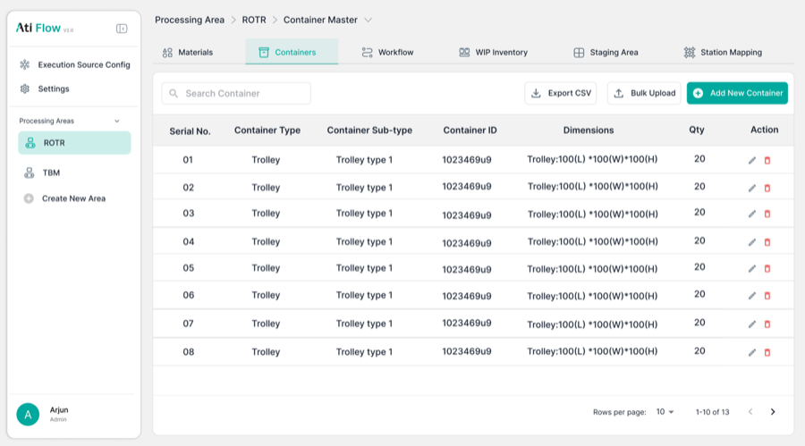
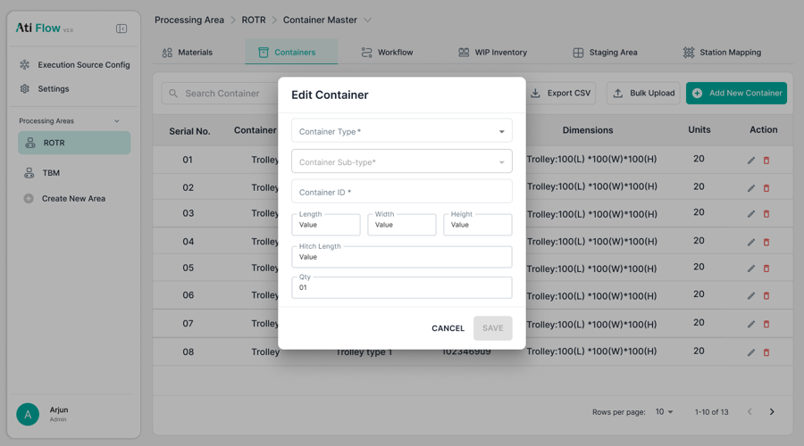
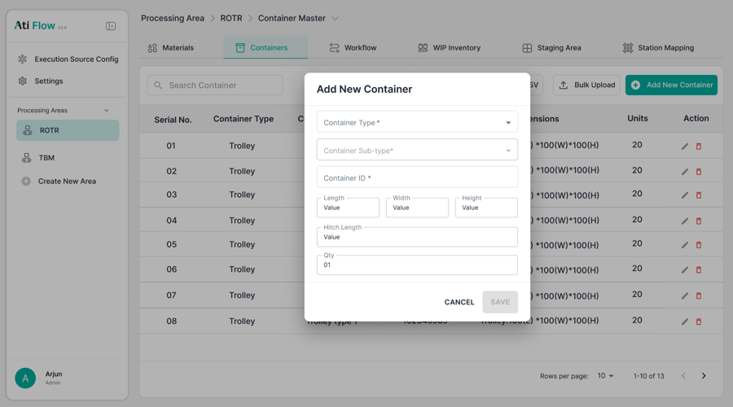

# 5. Container Master

Accessed via <strong>Processing Area → Containers tab</strong>.

!!! info "🔲 Unverified"
    Container Master is fully designed in Figma but **no app screenshots were captured**. Implementation is unverified.

## 5.1 Figma Design

<figure>
  
  <figcaption class="figma">Figma — Container Master (table view)</figcaption>
</figure>
<figure>
  
  <figcaption class="figma">Figma — Container Master (variant 2)</figcaption>
</figure>

<figure>
  
  <figcaption class="figma">Figma — Container Master (variant 3 / Add modal)</figcaption>
</figure>
<figure>
  
  <figcaption class="app">App — Containers tab (closest available)</figcaption>
</figure>

## 5.2 Figma Spec (for reference)

| Element | Figma Design |
|---------|-------------|
| Table columns | Serial No., Container Type, Sub-type, Container ID, Dimensions, Qty, Action |
| Add/Edit modal fields | Type, Sub-type, Container ID, Length / Width / Height, Hitch Length, Qty |
| Export CSV | Present |
| Bulk Upload | Present |
| Pagination | "1–10 of 13" |

!!! danger "Action Required"
    Capture app screenshots of the **Containers tab** to verify implementation against the Figma spec.
