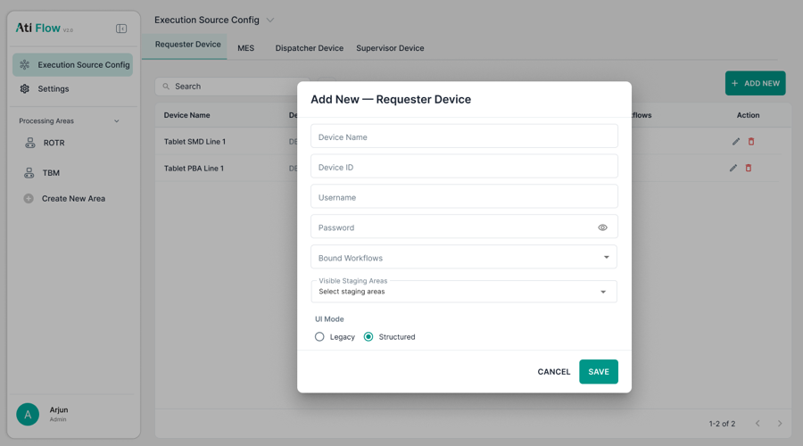
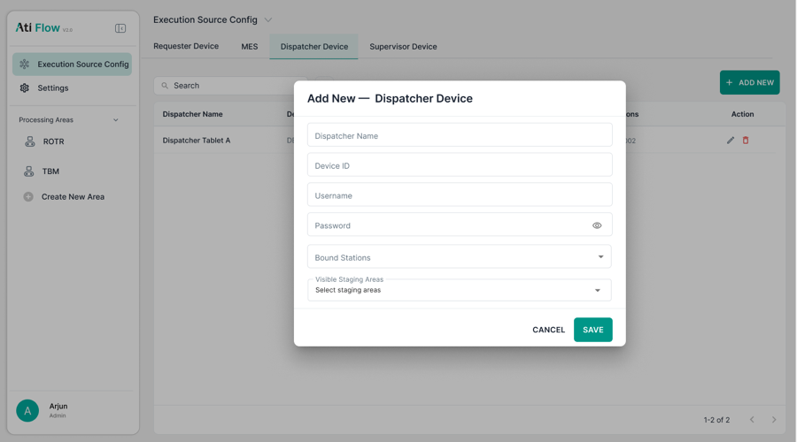
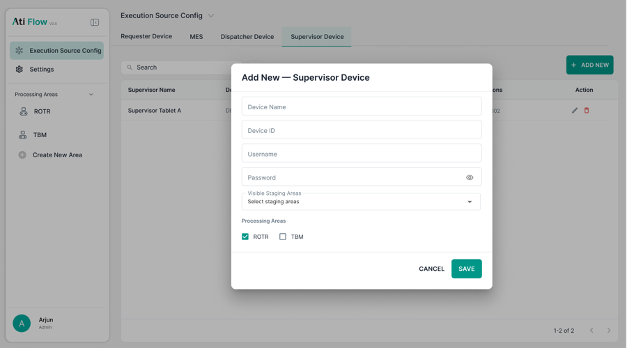

# 2. Device Config Modals

Modals triggered by <strong>+ ADD NEW</strong> or the edit pencil icon on any device tab.

## 2.1 Requester Device Modal

<figure>
  
  <figcaption class="figma">Figma — Add Requester Device</figcaption>
</figure>
<figure>
  
  <figcaption class="app">App — Add Requester Device</figcaption>
</figure>

| Field | Figma | App | Status |
|-------|-------|-----|--------|
| Device Name | ✅ | ✅ | ✅ Match |
| Device ID | ✅ | ✅ | ✅ Match |
| Username | ✅ | ✅ | ✅ Match |
| Password (eye toggle) | ✅ | ✅ | ✅ Match |
| Bound Workflows | ✅ | ✅ | ✅ Match |
| Visible Staging Areas | ✅ | ✅ | ✅ Match |
| UI Mode (Legacy / Structured radio) | ✅ | ⚠️ Not confirmed | ⚠️ Unverified |
| Required field asterisks (*) | ❌ Not designed | ✅ Red `*` on all fields | ➕ Added in app |

---

## 2.2 Dispatcher Device Modal

<figure>
  
  <figcaption class="figma">Figma — Add Dispatcher Device</figcaption>
</figure>
<figure>
  
  <figcaption class="app">App — Add Dispatcher Device</figcaption>
</figure>

| Field | Figma | App | Status |
|-------|-------|-----|--------|
| Dispatcher Name | ✅ | ✅ | ✅ Match |
| Device ID | ✅ | ✅ | ✅ Match |
| Username | ✅ Present | ❌ Absent | ❌ Removed in app |
| Password (eye toggle) | ✅ | ✅ | ✅ Match |
| Bound Stations | ✅ | ✅ chip/tag input | ⚠️ Interaction pattern differs |
| Visible Staging Areas | ✅ | ✅ chip/tag input | ⚠️ Interaction pattern differs |

> **Note:** Figma shows plain dropdowns. App uses multi-select chip/tag inputs with × remove buttons.

---

## 2.3 Supervisor Device Modal

<figure>
  
  <figcaption class="figma">Figma — Add Supervisor Device</figcaption>
</figure>
<figure>
  
  <figcaption class="app">App — Edit Supervisor Device</figcaption>
</figure>

| Field | Figma | App | Status |
|-------|-------|-----|--------|
| Device Name | ✅ | ✅ | ✅ Match |
| Device ID | ✅ | ✅ | ✅ Match |
| Username | ✅ Present | ❌ Absent | ❌ Removed in app |
| Password (eye toggle) | ✅ | ✅ | ✅ Match |
| Visible Staging Areas | ✅ Add + Edit | ⚠️ Add modal only | ⚠️ Missing from Edit modal |
| Processing Areas checkboxes | ✅ | ✅ | ✅ Match |

---

## 2.4 Modal Styling — All Modals

| Element | Figma | App | Status |
|---------|-------|-----|--------|
| Title format | "Add New — [Type]" / "Edit — [Type]" | Same | ✅ Match |
| CANCEL button | Text button, colour unspecified | Red uppercase `CANCEL` text link | ⚠️ Stronger red not in Figma |
| SAVE button | Teal filled | Teal filled | ✅ Match |
| Required field `*` | Not designed | Red `*` on all required fields | ➕ Added in app |
| Field label style | Floating label | Floating label | ✅ Match |
| Modal overlay | Grey | Grey | ✅ Match |
