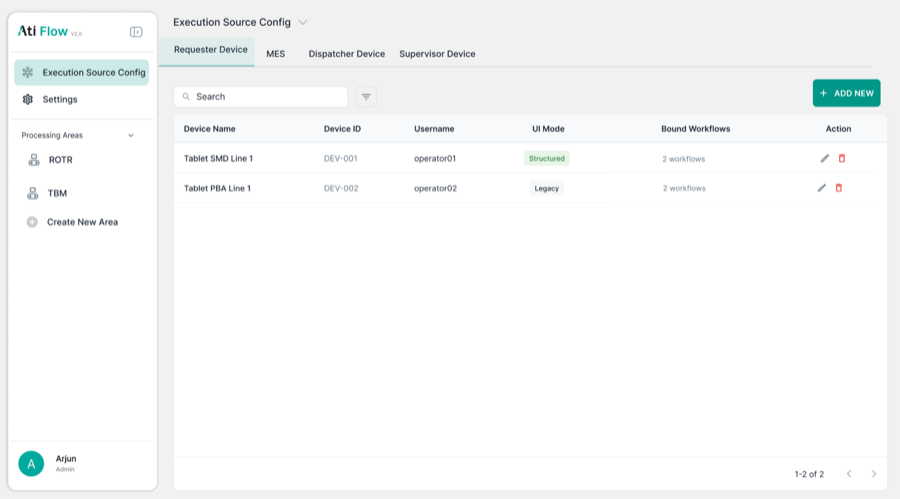
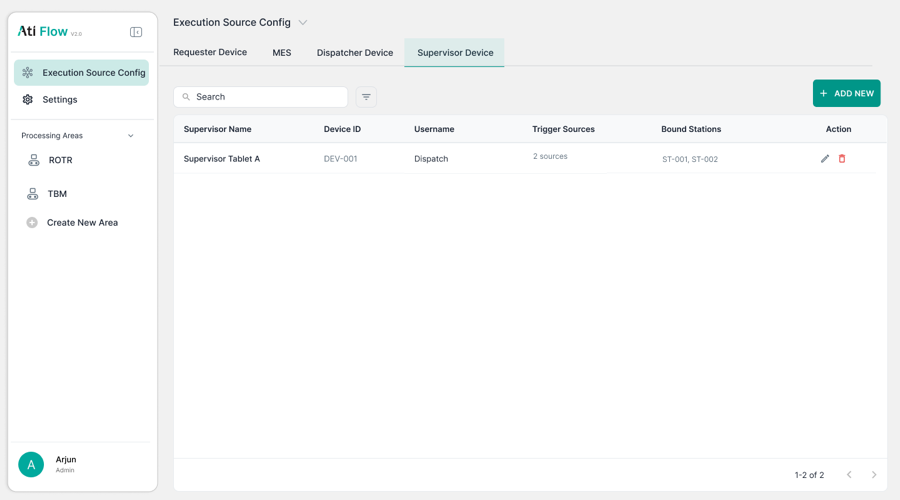
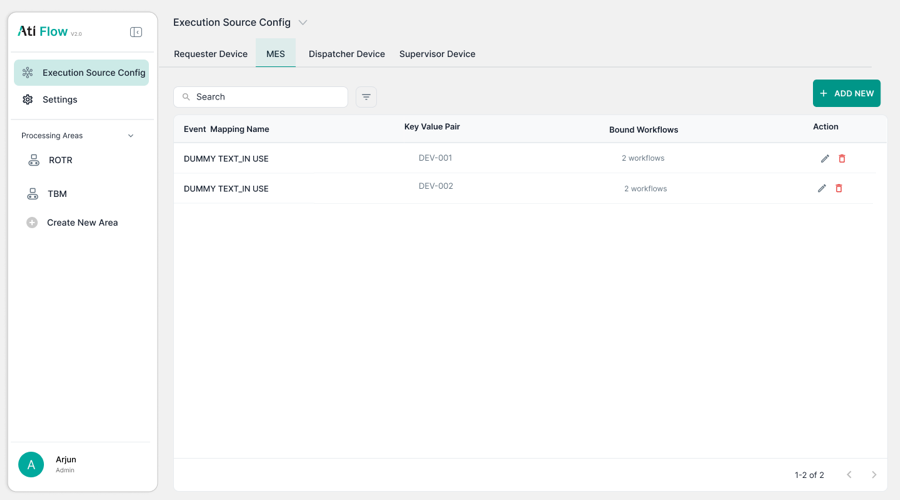

# 1. Execution Source Config

Page accessed via left nav → <strong>Execution Source Config</strong>. Contains 4 tabs: Requester Device, MES, Dispatcher Device, Supervisor Device.

## Tab Bar

<figure>
  
  <figcaption class="figma">Figma — Requester Device tab</figcaption>
</figure>
<figure>
  
  <figcaption class="app">App — Requester Device tab</figcaption>
</figure>

| Element | Figma | App | Status |
|---------|-------|-----|--------|
| 4 tabs present | ✅ | ✅ | ✅ Match |
| Active tab indicator | Teal underline | Teal underline | ✅ Match |
| Tab order | Requester / MES / Dispatcher / Supervisor | Same | ✅ Match |

---

## 1.1 Requester Device — Table Columns

| Column | Figma | App | Status |
|--------|-------|-----|--------|
| Device Name | ✅ | ✅ | ✅ Match |
| Device ID | ✅ | ✅ | ✅ Match |
| Username | ✅ Present | ❌ Absent | ❌ Removed in app |
| UI Mode | ✅ Present | ❌ Absent | ❌ Removed in app |
| Bound Machines | ❌ Not in Figma | ✅ Present | ➕ Added in app |
| Bound Workflows | ✅ | ✅ | ✅ Match |
| Action (edit/delete) | ✅ | ✅ | ✅ Match |

---

## 1.2 Dispatcher Device — Table Columns

<figure>
  
  <figcaption class="figma">Figma — Dispatcher Add modal</figcaption>
</figure>
<figure>
  
  <figcaption class="app">App — Add New Dispatcher Device modal</figcaption>
</figure>

| Column | Figma | App | Status |
|--------|-------|-----|--------|
| Dispatcher Name | ✅ | ✅ | ✅ Match |
| Device ID | ✅ | ✅ | ✅ Match |
| Bound Workflows | ✅ | ❌ Replaced | ❌ Not shown |
| Bound Stations | ❌ Not in Figma | ✅ Present | ➕ Added in app |
| Visible Staging Areas | ❌ Not in Figma | ✅ Present | ➕ Added in app |
| Action | ✅ | ✅ | ✅ Match |

---

## 1.3 Supervisor Device — Table Columns

<figure>
  
  <figcaption class="figma">Figma — Supervisor Device list</figcaption>
</figure>
<figure>
  
  <figcaption class="app">App — Edit Supervisor Device modal</figcaption>
</figure>

| Column | Figma | App | Status |
|--------|-------|-----|--------|
| Supervisor Name | ✅ | ✅ | ✅ Match |
| Device ID | ✅ | ✅ | ✅ Match |
| Username | ✅ Present | ❌ Absent | ❌ Removed in app |
| Trigger Sources | ✅ Present | ⚠️ Not confirmed | ⚠️ Unverified |
| Bound Stations | ✅ | ⚠️ Not confirmed in list | ⚠️ Unverified |
| Visible Staging Areas | ✅ (modal) | ⚠️ Add modal only | ⚠️ Missing from Edit modal |

---

## 1.4 MES Tab

<figure>
  
  <figcaption class="figma">Figma — MES tab (Event Mapping)</figcaption>
</figure>
<figure>
  
  <figcaption class="app">App — MES tab</figcaption>
</figure>

| Column | Figma | App | Status |
|--------|-------|-----|--------|
| Event Mapping Name | ✅ | ⚠️ Not confirmed | 🔲 Unverified |
| Key Value Pair | ✅ | ⚠️ Not confirmed | 🔲 Unverified |
| Bound Workflows | ✅ | ⚠️ Not confirmed | 🔲 Unverified |
