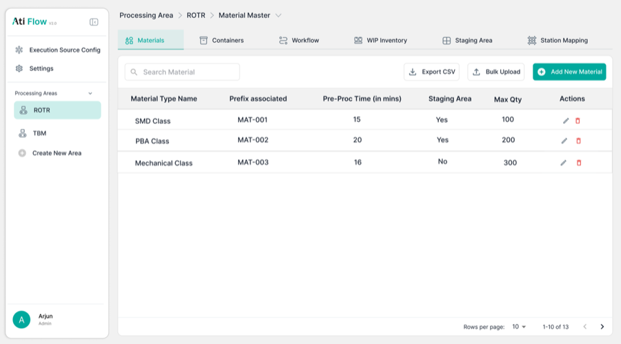

# 4. Materials Master

Accessed via <strong>Processing Area → Materials tab</strong>.

## 4.1 Table View

<figure>
  
  <figcaption class="figma">Figma — Materials Master table</figcaption>
</figure>
<figure>
  
  <figcaption class="app">App — Materials Master</figcaption>
</figure>

| Element | Figma | App | Status |
|---------|-------|-----|--------|
| Search placeholder | "Search Material" | "Search materials" | ⚠️ Minor copy difference |
| Material Type Name | ✅ | ✅ | ✅ Match |
| Production Unit | ❌ Not in Figma | ✅ Present | ➕ Added in app |
| Prefix Associated | ✅ | ✅ | ✅ Match |
| Pre-Processing Time | ✅ | ✅ | ✅ Match |
| Staging Area | ✅ | ✅ | ✅ Match |
| Max Qty | ✅ | ✅ | ✅ Match |
| Export CSV button | ✅ | ✅ | ✅ Match |
| Bulk Upload button | ✅ | ✅ | ✅ Match |

---

## 4.2 Add New Material Modal

<figure>
  
  <figcaption class="figma">Figma — Add Material (table context)</figcaption>
</figure>
<figure>
  
  <figcaption class="app">App — Add New Material modal</figcaption>
</figure>

| Field | Figma | App | Status |
|-------|-------|-----|--------|
| Material Type Name | ✅ | ✅ | ✅ Match |
| Production Unit | ✅ | ✅ | ✅ Match |
| Process Name | ❌ Not in Figma | ✅ Pre-filled with area name | ➕ Added in app |
| Pre-Proc Time (mins) | ✅ | ✅ | ✅ Match |
| Max Qty | ✅ | ✅ | ✅ Match |
| Staging Area toggle | ✅ | ✅ | ✅ Match |
| Prefix Associated | ✅ | ✅ | ✅ Match |
