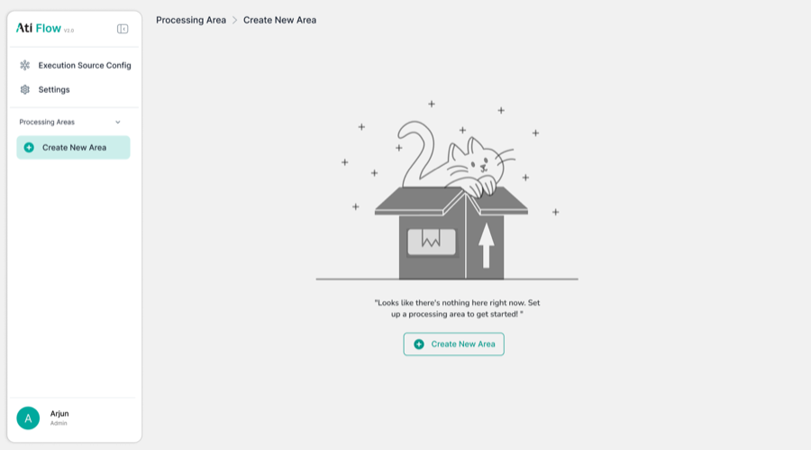

# 3. Per-Area Navigation Tabs

Tabs visible inside any Processing Area (e.g. QA_TestArea_01). Figma designed 6 tabs; the app ships 7.

<figure>
  
  <figcaption class="figma">Figma — sidebar & area context</figcaption>
</figure>
<figure>
  
  <figcaption class="app">App — full tab bar (7 tabs)</figcaption>
</figure>

| Tab | Figma | App | Status |
|-----|-------|-----|--------|
| Materials | ✅ | ✅ | ✅ Match |
| Containers | ✅ | ✅ | ✅ Match |
| Workflow | ✅ | ✅ | ✅ Match |
| WIP Inventory | ✅ | ✅ | ✅ Match |
| Staging Area | ✅ | ✅ | ✅ Match |
| Station Mapping | ✅ | ✅ | ✅ Match |
| **Processing Area** | ❌ Not in Figma | ✅ 7th tab | ➕ Entire tab added in app |

!!! warning "Processing Area 7th Tab"
    The **Processing Area** tab (rightmost) is not designed in Figma at all. It contains an "Add New Area" form with Area Name, Machine Name, and Point Type fields — a complete feature gap in the design.
