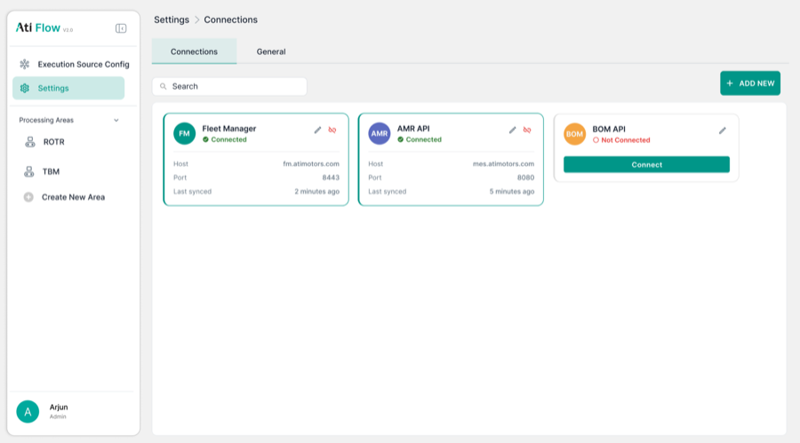
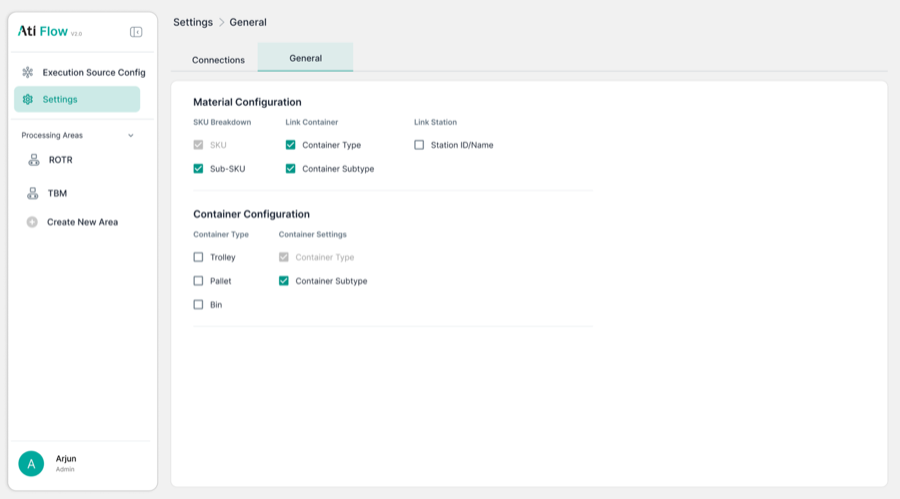

# 10. Settings

Accessed via left nav → <strong>Settings</strong>. Contains 2 tabs: Connections and General.

## 10.1 Connections Tab

<figure>
  
  <figcaption class="figma">Figma — Settings Connections (3 cards: FM, AMR, BOM API)</figcaption>
</figure>
<figure>
  
  <figcaption class="app">App — Settings Connections (FM edit modal)</figcaption>
</figure>

| Element | Figma | App | Status |
|---------|-------|-----|--------|
| FM card (Connected) | ✅ Green dot | ✅ | ✅ Match |
| AMR card (Connected) | ✅ Green dot | ✅ | ✅ Match |
| **BOM API card (Not Connected)** | ✅ Designed | ❌ Absent | ❌ Removed from app |
| FM Edit — Label + Connection Name | ✅ | ✅ | ✅ Match |
| FM Edit — Metadata Fields (Key/Label/Value) | ✅ | ✅ | ✅ Match |
| FM Edit — Client ID + Client Secret | ✅ | ✅ | ✅ Match |
| FM modal button | "Connect" | "Connect" | ✅ Match |
| AMR Edit — URL field | ✅ | ✅ | ✅ Match |
| **AMR Edit — Schedule field** | ❌ Not in Figma | ✅ "Schedule (s...)" numeric | ➕ Added in app |
| AMR modal button | "Save" | "Save" | ✅ Match |

### FM Connection Modal

<figure>
  
  <figcaption class="figma">Figma — Connections overview</figcaption>
</figure>
<figure>
  
  <figcaption class="app">App — FM Edit Connection modal</figcaption>
</figure>

### AMR Connection Modal

<figure>
  
  <figcaption class="figma">Figma — Connections overview</figcaption>
</figure>
<figure>
  
  <figcaption class="app">App — AMR Edit Connection modal (note Schedule field)</figcaption>
</figure>

---

## 10.2 General Tab

<figure>
  
  <figcaption class="figma">Figma — Settings General</figcaption>
</figure>
<figure>
  
  <figcaption class="app">App — Settings General (tab 1)</figcaption>
</figure>

<figure>
  
  <figcaption class="figma">Figma — Settings General (lower section)</figcaption>
</figure>
<figure>
  
  <figcaption class="app">App — Settings General (Material + Container config)</figcaption>
</figure>

| Element | Figma | App | Status |
|---------|-------|-----|--------|
| Material Configuration section | ✅ | ✅ | ✅ Match |
| SKU Breakdown: SKU checkbox | ✅ | ✅ | ✅ Match |
| SKU Breakdown: Sub-SKU checkbox | ✅ | ✅ | ✅ Match |
| Link Container: Container Type | ✅ Greyed | ✅ Greyed | ✅ Match |
| Link Container: Container Subtype | ✅ Greyed | ✅ Greyed | ✅ Match |
| Link Station: Station ID/Name | ✅ | ✅ | ✅ Match |
| Container Configuration section | ✅ | ✅ | ✅ Match |
| Container Types: Trolley, Pallet, Bin | ✅ Greyed | ✅ Greyed | ✅ Match |
| Save Changes button (disabled state) | ⚠️ Not clearly shown | ✅ Greyed when no changes | ✅ Match |
