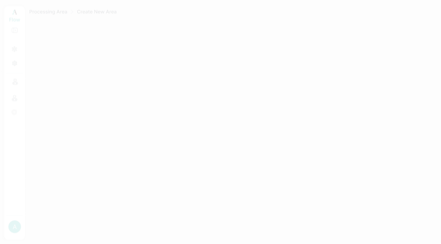

# 11. Sidebar / Global Navigation

Persistent left sidebar visible on all admin screens.

<figure>
  
  <figcaption class="figma">Figma — Sidebar expanded</figcaption>
</figure>
<figure>
  
  <figcaption class="app">App — Sidebar (in Execution Source Config)</figcaption>
</figure>

<figure>
  
  <figcaption class="figma">Figma — Sidebar collapsed state</figcaption>
</figure>
<figure>
  
  <figcaption class="app">App — Sidebar with Processing Areas expanded</figcaption>
</figure>

| Element | Figma | App | Status |
|---------|-------|-----|--------|
| Logo: "AtiFlow v2.0" | ✅ | ✅ | ✅ Match |
| Nav: Execution Source Config | ✅ | ✅ | ✅ Match |
| Nav: Settings | ✅ | ✅ | ✅ Match |
| Processing Areas section with collapse | ✅ | ✅ | ✅ Match |
| Area items with 3-dot menu | ✅ | ✅ | ✅ Match |
| Create New Area button | ✅ | ✅ | ✅ Match |
| Collapsed sidebar (icon-only) | ✅ Designed | ✅ `«` toggle present | ⚠️ Full collapsed state not compared |
| User avatar (teal, initial) | ✅ | ✅ | ✅ Match |
| Username | "Arjun" (sample data) | "admin" (live) | ⚠️ Sample vs real data |
| Role | "Admin" | "Admin" | ✅ Match |
| Logout item | ✅ | ✅ | ✅ Match |
