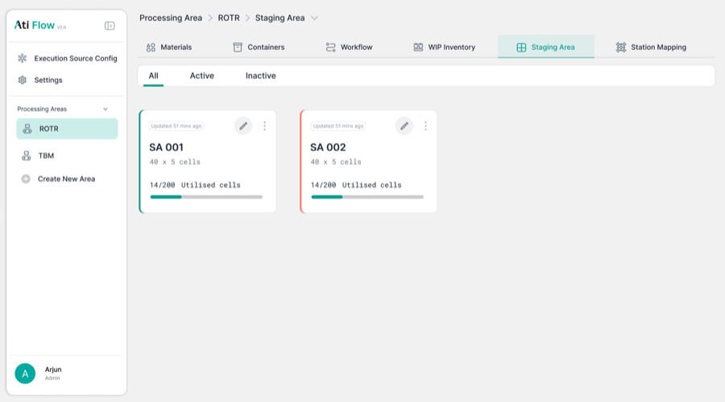
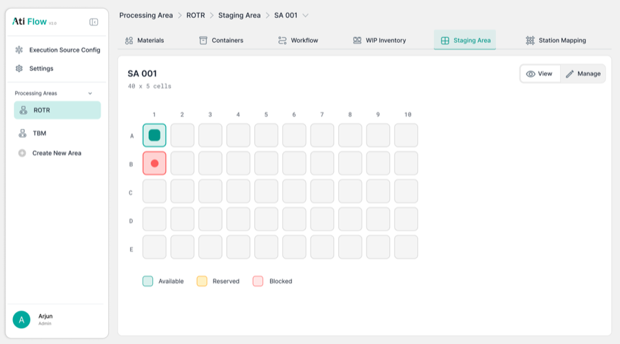

# 8. Staging Area

Accessed via <strong>Processing Area → Staging Area tab</strong>. Shows a visual grid of staging cells with state colour-coding.

## 8.1 Grid View

<figure>
  
  <figcaption class="figma">Figma — Staging Area grid (large)</figcaption>
</figure>
<figure>
  
  <figcaption class="app">App — Staging Area grid (staging_map, 3×2)</figcaption>
</figure>

| Element | Figma | App | Status |
|---------|-------|-----|--------|
| Grid size | Large (~10×5 cells) | Smaller (3×2 in screenshots) | ⚠️ Config-dependent |
| Available — teal square icon | ✅ | ✅ | ✅ Match |
| Reserved — yellow diamond icon | ✅ | ✅ | ✅ Match |
| Blocked — coral circle icon | ✅ | ✅ | ✅ Match |
| Filled — light blue square | ✅ | ✅ | ✅ Match |
| Legend (all 4 states) | ✅ | ✅ | ✅ Match |
| View / Manage toggle buttons | ✅ | ✅ | ✅ Match |
| Breadcrumb navigation | ✅ | ✅ | ✅ Match |

---

## 8.2 Staging Area — Manage Mode

<figure>
  
  <figcaption class="figma">Figma — Staging Area (manage mode)</figcaption>
</figure>
<figure>
  
  <figcaption class="app">App — Cell B1 edit modal</figcaption>
</figure>

| Element | Figma | App | Status |
|---------|-------|-----|--------|
| Cell B1 / cell management modal | ❌ **Not designed** | ✅ Cell State + "Filled with" dropdowns | ➕ Entirely added in app |

!!! warning "Missing from Figma"
    The cell edit modal (Cell State dropdown: Available / Reserved / Blocked / Filled + "Filled with" dropdown) is a complete feature with no Figma design counterpart.
