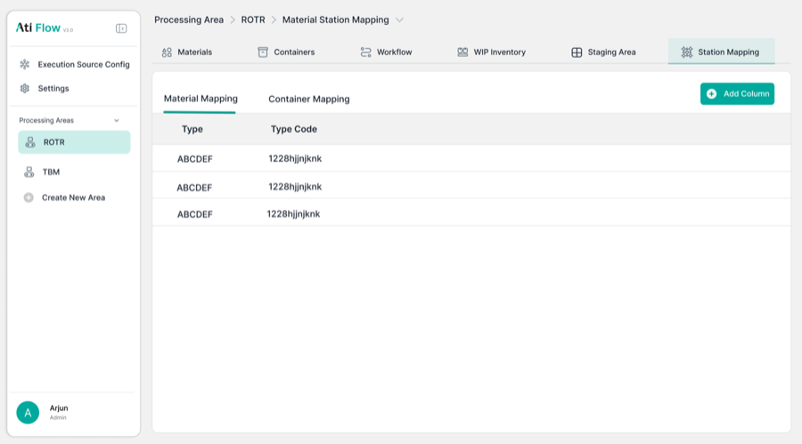
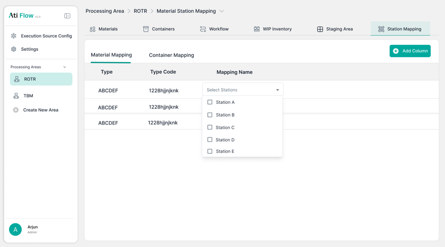
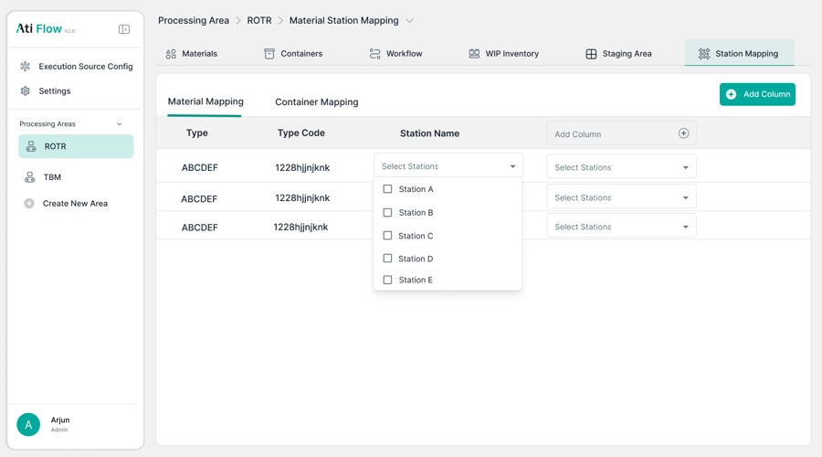
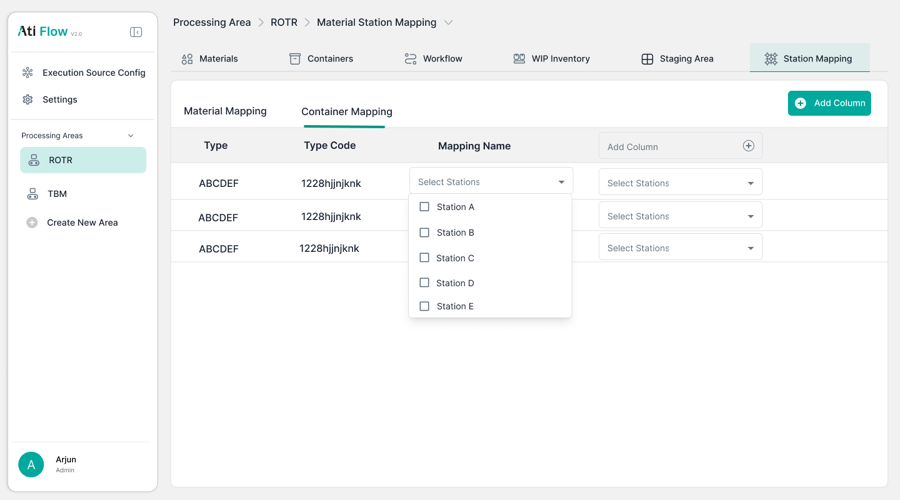

# 9. Station Mapping

Accessed via <strong>Processing Area → Station Mapping tab</strong>.

!!! info "🔲 Unverified"
    Station Mapping is fully designed in Figma but **no app screenshots were captured**. Implementation is unverified.

## 9.1 Figma Design

<figure>
  
  <figcaption class="figma">Figma — Station Mapping (variant 1)</figcaption>
</figure>
<figure>
  
  <figcaption class="figma">Figma — Station Mapping (variant 2)</figcaption>
</figure>

<figure>
  
  <figcaption class="figma">Figma — Mapping (variant 3)</figcaption>
</figure>
<figure>
  
  <figcaption class="figma">Figma — Mapping (variant 4)</figcaption>
</figure>

## 9.2 Figma Spec (for reference)

| Element | Figma Design |
|---------|-------------|
| Sub-tabs | Material Mapping / Container Mapping |
| Table columns | Type, Type Code, Mapping Name, Station columns (multi-select) |
| Station assignment | Checkbox dropdowns per station (Station A–E) |
| "Add Column" button | Dynamic — adds new station column |

!!! danger "Action Required"
    Capture app screenshots of the **Station Mapping tab** to verify implementation against Figma spec.
