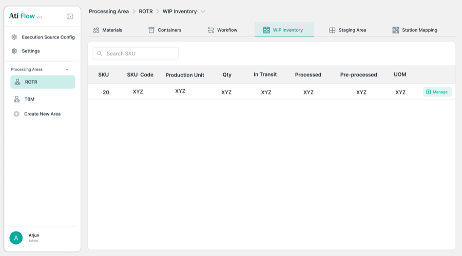
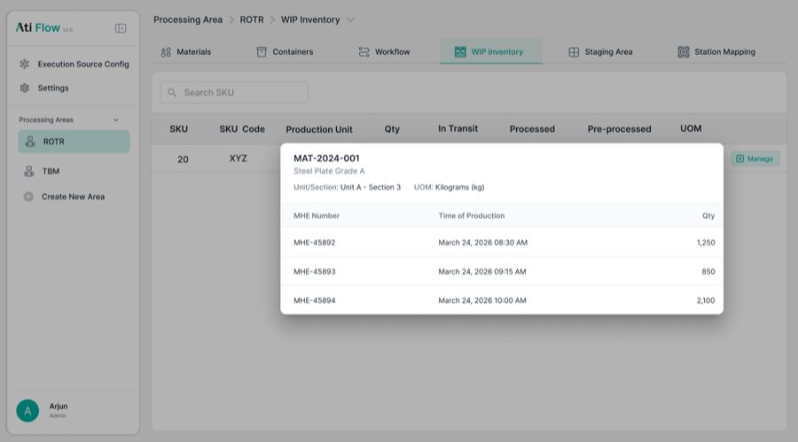

# 7. WIP Inventory

Accessed via <strong>Processing Area → WIP Inventory tab</strong>.

<figure>
  
  <figcaption class="figma">Figma — WIP Inventory (populated state)</figcaption>
</figure>
<figure>
  
  <figcaption class="app">App — WIP Inventory (empty state)</figcaption>
</figure>

<figure>
  
  <figcaption class="figma">Figma — WIP Inventory (expanded row detail modal)</figcaption>
</figure>
<figure>
  
  <figcaption class="app">App — WIP Inventory (detail view)</figcaption>
</figure>

| Element | Figma | App | Status |
|---------|-------|-----|--------|
| Search placeholder | "Search SKU" | "Search by SKU, SKU Code" | ⚠️ Copy differs |
| Material Type Name | ✅ | ✅ | ✅ Match |
| Code (SKU Code) | ✅ | ✅ | ✅ Match |
| Production Unit | ✅ | ✅ | ✅ Match |
| In Transit | ✅ | ✅ | ✅ Match |
| Processed | ✅ | ✅ | ✅ Match |
| Pre-processed | ✅ | ✅ | ✅ Match |
| **Requested** | ❌ Not in Figma | ✅ Present | ➕ Added in app |
| **Total Qty** | ❌ Not in Figma | ✅ Present | ➕ Added in app |
| UOM | ✅ | ✅ | ✅ Match |
| Expanded row detail modal | ✅ Designed | 🔲 Not captured | 🔲 Unverified |
| **Refresh button** | ❌ Not in Figma | ✅ Present | ➕ Added in app |
| **"Updated just now" timestamp** | ❌ Not in Figma | ✅ Present | ➕ Added in app |
