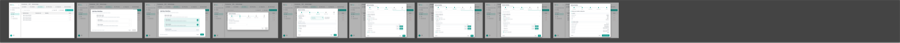

# 6. Workflow Wizard

Accessed via <strong>Processing Area → Workflow tab → + New Workflow</strong>. 5-step wizard: Order Types → Basics → Material Order → Container Order → Review.

## 6.1 Figma Workflow Section Overview

  
  
Figma — full Workflow section (all wizard steps side by side)

---

## 6.2 Step Indicator Bar

<figure>
  
  <figcaption class="figma">Figma — step indicator strip</figcaption>
</figure>
<figure>
  
  <figcaption class="app">App — workflow wizard step indicator</figcaption>
</figure>

| Element | Figma | App | Status |
|---------|-------|-----|--------|
| Active step | Teal filled circle + number | Same | ✅ Match |
| Completed step | Teal circle + white checkmark | Same | ✅ Match |
| Future step | Grey outlined circle + number | Same | ✅ Match |
| Connecting line | Teal when passed, grey for future | Same | ✅ Match |
| Step labels below circles | ✅ | ✅ | ✅ Match |
| Step names | Order Types → Basics → Material Order → Container Order → Review | Same | ✅ Match |

---

## 6.3 Step 2 — Basics

<figure>
  
  <figcaption class="figma">Figma — Step 2: Basics section</figcaption>
</figure>
<figure>
  
  <figcaption class="app">App — Step 2: Basics</figcaption>
</figure>

| Field | Figma | App | Status |
|-------|-------|-----|--------|
| Workflow Name input | ✅ | ✅ | ✅ Match |
| Auto Trip toggle | ✅ | ✅ | ✅ Match |
| Consumption Unit dropdown | ✅ | ✅ | ✅ Match |

---

## 6.4 Step 3 — Material Order / Station Configuration

<figure>
  
  <figcaption class="figma">Figma — Step 3: Station Configuration</figcaption>
</figure>
<figure>
  
  <figcaption class="app">App — Step 3: Static mode</figcaption>
</figure>

<figure>
  
  <figcaption class="figma">Figma — Step 3: Mapping-based mode</figcaption>
</figure>
<figure>
  
  <figcaption class="app">App — Step 3: Mapping-based mode</figcaption>
</figure>

| Element | Figma | App | Status |
|---------|-------|-----|--------|
| "Pickup" section header + vehicle icon | ✅ | ✅ | ✅ Match |
| Station Selection: Static → "Station Name *" | ✅ Dropdown | ✅ Dropdown | ✅ Match |
| Station Selection: Mapping-based → "Mapping ID *" | ✅ Dropdown | ✅ + **blue active border** | ⚠️ Active state not spec'd |
| Info tooltip ⓘ next to section headers | ✅ | ✅ | ✅ Match |
| Confirmation Mode table (Station Type / Mode) | ✅ | ✅ | ✅ Match |
| Auto / Manual toggle pill buttons (teal = active) | ✅ | ✅ | ✅ Match |
| Action Type radios (Pick, Auto-hitch, Manual) | ✅ | ✅ | ✅ Match |

!!! success "Best-implemented section"
    The Workflow wizard is the **most faithfully implemented section** — very close to Figma spec throughout.
